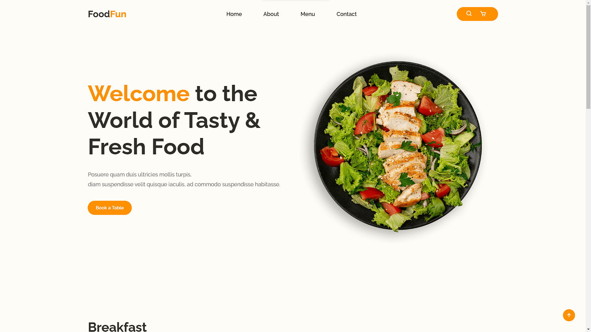
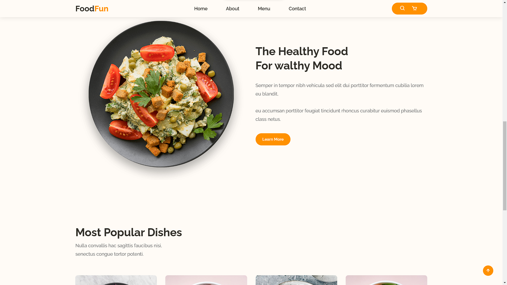
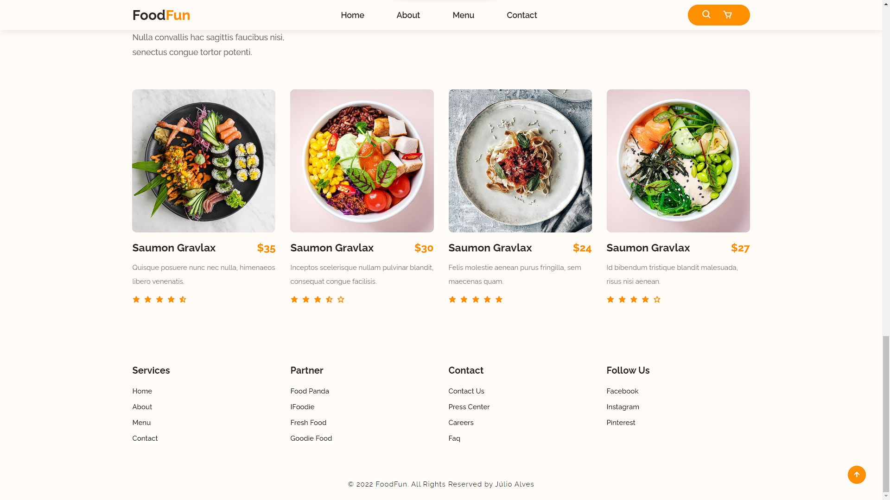

<h1 align="center">
   FoodFun
</h1>

<p align="center">
  <a href="#-technologies">Technologies</a>&nbsp;&nbsp;&nbsp;|&nbsp;&nbsp;&nbsp;
  <a href="#-layout">Getting started</a>&nbsp;&nbsp;&nbsp;|&nbsp;&nbsp;&nbsp;
  <a href="#-project">Project</a>
</p>

<br>

## Site Demonstration
<p align="center">
  
</p>

---

<p align="center">
  
</p>

---

<p align="center">
  
</p>

## 🧪 Technologies

This project was developed using the following technologies:

- [Javascript](https://#)
- [HTML](https://#)
- [CSS](https://#)

## 🚀 Getting started

Clone the project and access the folder.

```bash
$ gh repo clone JulioAlvesRJ/Food_Website && cd project
```

Follow the steps below

1.  Go to the project on VsCode and run with LiveServer extension.

2. Or [Click on this link to enter the site](https://julioalvesrj.github.io/Food_Website/)

## 💻 Project

This is a project developed based on my skills in web development. This project is responsive so you can open and use on mobile phones with no problem, and i use some cool features to make this site look more interesting and great for the client. 

---

<p align="center">Made by Júlio Alves</p>